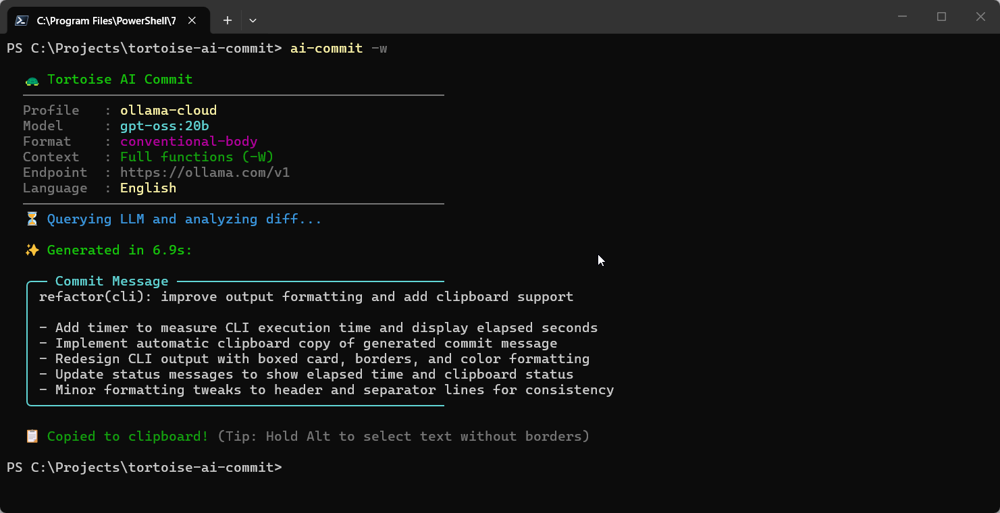

# Tortoise AI Commit 🐢✨

> A lightweight, dual-mode **TortoiseGit hook & CLI tool** that automatically generates clean, informative commit messages in **Conventional Commits** format using any OpenAI-compatible AI backend (local Ollama, LM Studio, OpenAI, OpenRouter, etc.).

<p align="center">
  
</p>

---

## 🌟 Key Features

- 🎯 **Dual Mode Operation:**
  - **TortoiseGit Hook:** Automatically pre-fills the TortoiseGit commit message area upon opening the commit dialog.
  - **Standalone CLI:** Run `ai-commit` directly in your favorite terminal (CMD, PowerShell, Windows Terminal) with formatted console output.
- 🔌 **Universal OpenAI-Compatible API:** Works seamlessly with local models via **Ollama** or **LM Studio**, as well as cloud providers like **OpenAI**, **OpenRouter**, or **Groq**.
- ⚡ **Instant Provider Profiles:** Switch between configured providers (Ollama, OpenAI, LM Studio, etc.) by changing a single word (`$AI_ACTIVE_PROFILE`).
- 📋 **Modular Commit Formats:** Easily switch between built-in format templates or add your own in the `prompts/` directory:
  - `conventional-body` (default: subject line + bullet points with dashes)
  - `conventional` (single-line summary)
  - `gitmoji` (emoji-prefixed conventional commits)
- 🔍 **Deep Function Context (`-w` / `--context`):** Use `git diff -W` to provide the LLM with the entire enclosing function context, producing far more accurate commit descriptions for localized changes.
- 🎯 **Targeted File Selection:** Pass specific files directly in the CLI (`ai-commit file1 file2`) to generate messages exclusively for those changes.
- 🧹 **Smart Draft & Scratchpad Filter:** Automatically exclude untracked drafts, notes, or scratchpads using customizable glob patterns (`$AI_EXCLUDE`).
- 🌐 **Universal Multilingual Support:** Supports any ISO 639-1 language code (`en`, `ru`, `de`, `es`, `fr`, `ja`, etc.) or full language name via built-in .NET `CultureInfo`.
- 🛠️ **PowerShell 5.1 Mojibake Auto-Fix:** Contains built-in byte reconstruction to prevent Windows PowerShell encoding bugs with Cyrillic or special characters.

---

## 📂 Project Structure

```text
tortoise-ai-commit/
├── prompts/
│   ├── conventional-body.txt  # Default: subject + bullet points with dashes
│   ├── conventional.txt       # Single-line conventional commit
│   └── gitmoji.txt            # Gitmoji conventional commit
├── ai-commit.ps1              # Main hook and CLI engine
├── ai-commit.cmd              # Command wrapper for fast terminal execution
├── environment.example.ps1    # Configuration template (copy to environment.ps1)
├── .gitignore                 # Excludes local secrets (environment.ps1)
├── LICENSE                    # MIT License
└── README.md
```

---

## 🚀 Installation & Setup

### Step 1: Clone the Repository

Clone this repository to a stable directory on your machine (e.g., `C:\Tools\tortoise-ai-commit`):

```bash
git clone https://github.com/goloveshko/tortoise-ai-commit.git C:\Tools\tortoise-ai-commit
```

### Step 2: Configure Environment

1. In the project folder, duplicate `environment.example.ps1` and rename it to **`environment.ps1`**.
2. Open `environment.ps1` and adjust your preferences:
   - **Active Profile:** Set `$AI_ACTIVE_PROFILE = "ollama"` (or `"openai"`, `"lm-studio"`, `"openrouter"`).
   - **Format:** Choose `$AI_FORMAT = "conventional-body"` (or `"conventional"`, `"gitmoji"`).
   - **Language:** Set `$AI_LANGUAGE = "en"` (or `"ru"`, `"de"`, `"es"`, etc.).
   - **Exclusions:** Modify `$AI_EXCLUDE` for draft/temporary files.

> 💡 **Recommended local model:** [`qwen2.5-coder:7b`](https://ollama.com/library/qwen2.5-coder). It is fast, lightweight, and excels at understanding Git diffs.

---

## 🖥️ Usage

### Option A: Standalone CLI (Terminal)

To run `ai-commit` from anywhere in any terminal:

1. Add `C:\Tools\tortoise-ai-commit` to your Windows **PATH** environment variable.
2. Open any terminal in any Git repository and run:

```bash
# Generate commit message for all staged/unstaged changes:
ai-commit

# Generate with full function context (-W / --function-context):
ai-commit -w

# Generate only for specific files:
ai-commit src/main.cpp include/config.h

# Combine flags and specific files:
ai-commit -w src/auth.go
```

### Option B: TortoiseGit Hook (GUI)

To have commit messages generated automatically when opening TortoiseGit:

1. Right-click anywhere in Windows Explorer and open **TortoiseGit → Settings**.
2. In the left navigation tree, select **Hook Scripts**.
3. Click **Add...**:
   - **Hook Type:** Select `Start Commit Hook`.
   - **Run when working tree path is under:** Enter `*` _(asterisk applies the hook to all repositories)_ or specify a particular repository path.
   - **Command Line To Execute:**
     ```cmd
     powershell.exe -ExecutionPolicy Bypass -File "C:\Tools\tortoise-ai-commit\ai-commit.ps1"
     ```
     _(⚠️ Adjust to your actual path. Do NOT append `%1` or `%2` — TortoiseGit appends them automatically)._
   - **Wait for the script to finish:** ✅ Checked.
   - **Hide the script while running:** ✅ Checked.
   - **Enable:** ✅ Checked (at the top of the dialog).
4. Click **OK** and **Apply**.

> ⏱️ **Note on TortoiseGit Delay:** When clicking _Git Commit..._, the dialog will take **2 to 5 seconds** to appear. This delay occurs because the hook queries the LLM and pre-fills the message before the window is rendered.

---

## ⚙️ Advanced Customization

### Adding Custom Commit Formats

Create a new text file inside the `prompts/` directory (e.g., `prompts/my-style.txt`). In your `environment.ps1`, specify:

```powershell
$AI_FORMAT = "my-style"
```

Use `{{LANG_INSTRUCTION}}` inside your prompt file to allow dynamic language substitution.

### Expanding Function Context Globally

If you always want the AI to analyze entire functions instead of small diff hunks, enable it in `environment.ps1`:

```powershell
$AI_EXPAND_CONTEXT = $true
```

---

## ❓ Troubleshooting

### The commit message shows `# [AI Error]`

If the AI server is unreachable, times out, or returns an error, the script will write an error description directly into the commit text box (or terminal output).

- If using **Ollama**, verify that the service is running (`ollama list` or check the system tray).
- Verify that the model specified in your profile is downloaded (`ollama pull qwen2.5-coder:7b`).
- Check your network connection and API keys for cloud providers.

### Execution Policy Error

If PowerShell scripts are restricted on your system, ensure `-ExecutionPolicy Bypass` is included in the hook command:

```cmd
powershell.exe -ExecutionPolicy Bypass -File "C:\Tools\tortoise-ai-commit\ai-commit.ps1"
```

---

## 📄 License

This project is licensed under the [MIT License](LICENSE).

---

## ☕ Support & Feedback

Developed with ❤️ by a professional C++ & Qt developer.

- **Telegram Support Bot**: [@itz2bot](https://t.me/itz2bot?start=ai_commit_readme)
- **Portfolio**: [sergey.is-a.dev](https://sergey.is-a.dev)
- **GitHub Issues**: [Report a bug](https://github.com/goloveshko/tortoise-ai-commit/issues)
